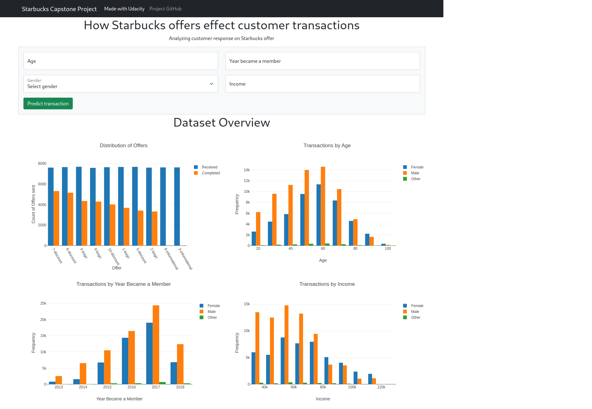
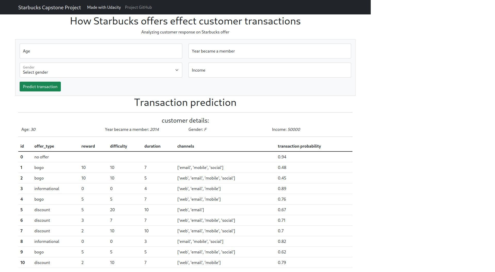

# Starbucks Capstone

### Description

The data set for this project contains simulated data that mimics customer behavior on the Starbucks rewards mobile app. Once every few days, Starbucks sends out an offer to users of the mobile app. An offer can be merely an advertisement for a drink or an actual offer such as a discount or BOGO (buy one get one free). Some users might not receive any offer during certain weeks.

#### Data Sets

The data is contained in three files:

* portfolio.json - containing offer ids and meta data about each offer (duration, type, etc.)
* profile.json - demographic data for each customer
* transcript.json - records for transactions, offers received, offers viewed, and offers completed

In this project I modified the transactions data set the way that each record would represent all the data about specific offer for specific customer. So I had to combine a few records in one for each customer/offer combination. Then I combined data from all 3 data sets.  
After cleaning the data I created a machine learning model for predicting customer transaction based on demographics and offer.  
As a result of the project I created a web app, which uses machine learning model to predict customer response to different offers depending on customer demographics.  
I deployed the app on Heroku: https://nat-sb-offers.herokuapp.com/

#### Project Steps

1. Data exploration with visualizations
2. Modification of transactions the way that there is only one record for each customer/offer combination
3. Combining transactions data with customer and offer data
4. Cleaning data
5. Training and tuning ML model
6. Creating a [Flask app](https://nat-sb-offers.herokuapp.com/)

### Web app screenshots

---

### Instructions to run the app

1. Go to **app** directory
2. Run the following command:  
	`$ python app.py`
3. In your web browser go to http://0.0.0.0:3001/

### Project files

    - app
    | - templates
    | | - go.html                        # ML result page of web app
    | | - home.html                      # main page of web app
    | - app.py                           # Flask file that runs app
	| - plots.py                         # Functions responsible for visualizations on the main page

    - data
	| - combined.csv (*)                 # combined data before cleaning
	| - offers.csv (*)                   # precleaned offers data
    | - portfolio.json                   # provided offers data
    | - profile.json                     # provided customers data
	| - transcript.json                  # provided data for transactions, offers received, offers viewed, and offers completed

    - model
    | - model_lr.pkl (*)                 # saved Logistic Regression classification model
	| - model_rfc.pkl (*)                # saved Random Forest classification model

    - README.md                          # project description
	- Starbucks_Capstone_notebook.ipynb  # project Jupyter notebook
    - requirements.txt                   # required libraries
	- utils.py                           # helper functions for the notebook

 (*) - output of running the notebook

### Acknowledgments

https://stackoverflow.com/  
https://seaborn.pydata.org/api.html
